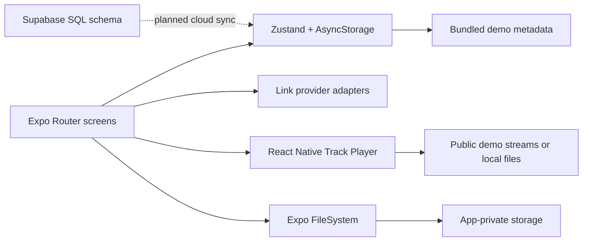

# SoundStash

SoundStash is a mobile-first personal audio library for organizing and playing sounds discovered on TikTok, Instagram, and the web.

## Overview

Short-form platforms make sounds easy to discover but difficult to organize across services. SoundStash provides one searchable library, playlists, a playback queue, background audio controls, and permitted offline downloads.

This repository is an early, local-first MVP. It includes ten public demo audio streams so the core experience can be evaluated without social-platform or backend credentials. Pasted links are saved as metadata and retain their original URL; the app does not scrape or bypass platform media restrictions.

## Demo

No hosted demo, screenshots, or release build are included yet. Playback requires an iOS or Android development build because `react-native-track-player` contains native code and is not available in Expo Go.

## Architecture



- `app/`: file-based routes for the tab shell, player, and link-import flow.
- `store/`: persisted local library, playlists, queue, and playback preferences.
- `services/audio/`: player initialization and background/lock-screen handlers.
- `services/downloads/`: permitted downloads to app-private storage.
- `services/social/`: capability-aware TikTok, Instagram, and generic URL adapters.
- `features/`: demo data and pure queue utilities.
- `supabase/migrations/`: an optional, future-facing schema with row-level security. It is not connected to the app yet.

## How it works

On first launch, the Zustand store seeds the library with demo metadata and persists subsequent changes through AsyncStorage. Selecting a playable track rebuilds the native queue, selects that track, and starts playback. The registered background service handles lock-screen play, pause, seek, previous, and next actions.

The download screen accepts only tracks explicitly marked `DOWNLOADABLE`, saves them under the app document directory, and records the resulting local URI. The player prefers that local file over the remote stream.

Link import validates a URL, identifies TikTok or Instagram by hostname, and creates a metadata-only library item. OAuth, remote metadata resolution, scraping, and social saved-sound synchronization are not implemented.

SoundStash does not contain AI/LLM, agent, RAG, or model-inference functionality.

## Tech stack

- Expo SDK 57 and React Native 0.86 for the mobile application.
- TypeScript with strict checking and Expo Router for file-based navigation.
- React Native Track Player for native/background playback.
- Zustand and AsyncStorage for local persisted state.
- Expo FileSystem for app-private downloads.
- Zod for imported URL validation.
- Jest with `jest-expo` for unit tests.
- PostgreSQL/Supabase SQL as a prepared, currently disconnected cloud schema.

## Getting started

Prerequisites:

- Node.js 22.13 or newer (the minimum for Expo SDK 57)
- npm
- Xcode for iOS builds or Android Studio for Android builds

```bash
git clone <repository-url>
cd soundstash
npm ci
```

The local demo requires no environment variables. Create a local environment file only if working on the planned Supabase integration:

```bash
cp .env.example .env
```

Create and run a native development build:

```bash
# iOS simulator
npm run ios

# Connected iOS device
npm run ios:device

# Android development build / Metro
npm run android
```

After the native app is installed, start Metro with:

```bash
npm run dev
```

Use `npm run dev:lan` for a physical device on the same network or `npm run dev:tunnel` when LAN discovery is unavailable. Rebuild after changing native dependencies, config plugins, entitlements, or native app configuration.

## Configuration

The variables below are reserved for planned cloud sync and are not read by the current app:

| Variable | Purpose | Secret? |
| --- | --- | --- |
| `EXPO_PUBLIC_SUPABASE_URL` | Supabase project URL | No |
| `EXPO_PUBLIC_SUPABASE_ANON_KEY` | Publishable/anonymous browser key protected by RLS | No, but project-specific |

Every `EXPO_PUBLIC_` value is embedded in the client bundle. Never place service-role keys, OAuth client secrets, or other credentials in these variables. See [SECURITY.md](SECURITY.md).

## Testing

```bash
npm run typecheck
npm test
npx expo-doctor
```

Current tests cover queue progression, repeat and shuffle behavior, URL deduplication, platform detection, and provider capability declarations. There are no component, integration, native playback, download, database-policy, or end-to-end tests, and no coverage threshold is configured.

## Engineering decisions

- Local-first demo mode keeps setup reproducible and lets reviewers exercise the UI without receiving credentials.
- A custom entry point registers the Track Player background service before loading Expo Router.
- Provider capability flags make unavailable platform integrations explicit instead of simulating unsupported API access.
- Downloads are gated by an availability value and stored privately by the app; metadata-only imports are never treated as downloadable media.
- The Supabase migration enables owner-scoped row-level-security policies, but backend integration remains deliberately separate from the working local MVP.

## Limitations

- TikTok and Instagram imports store only user-supplied links and placeholder metadata.
- Supabase authentication and synchronization are not connected.
- There is no native share extension.
- Native playback and offline behavior still require physical-device acceptance testing.
- Demo artwork and audio depend on third-party public endpoints and may become unavailable.
- Accessibility, error recovery, observability, and UI-level test coverage are limited.
- Web is not a supported playback target.

## Roadmap

1. Add screenshots or a short physical-device demo and document a repeatable acceptance test.
2. Add component and integration tests around importing, downloading, and persisted state.
3. Improve player/download error states and add privacy-conscious crash reporting before distribution.
4. Connect Supabase Auth and the existing schema only when cloud sync is required.
5. Add official social-platform metadata/OAuth integrations only when approved API access and usage rights are available.
6. Build an iOS share extension after the core native build is stable.

## License

Licensed under the MIT License. See [LICENSE](LICENSE).
